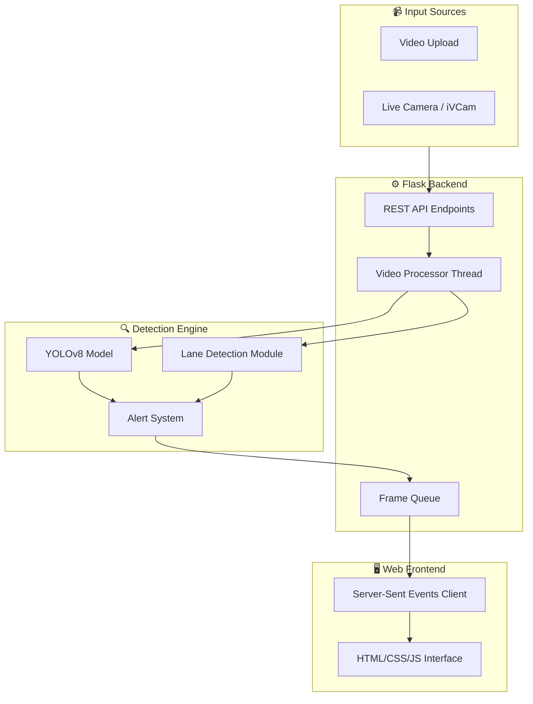

# 🚗 Road Safety Detection System

An intelligent road safety system that combines **pothole detection** and **lane departure warning** using computer vision and deep learning. Built as a Final Year Project.


---

## 🏗️ System Architecture



---

## 📦 Modules Overview

### 1. Web Interface (`templates/index.html`, `static/style.css`, `static/script.js`)

The frontend provides a modern, responsive UI with:
- **Mode Selection**: Choose between video upload or live camera
- **Real-time Video Display**: Shows processed frames with detections
- **Status Dashboard**: Displays pothole status, lane status, and offset

**Technologies**: HTML5, CSS3 (Glassmorphism), JavaScript (ES6), Server-Sent Events

---

### 2. Flask Backend (`app.py`)

The core server that handles:
- **API Endpoints**: `/api/start`, `/api/stop`, `/api/stream`, `/api/status`
- **Video Processing Thread**: Runs detection in background
- **SSE Streaming**: Pushes frames and stats to frontend in real-time
- **File Handling**: Manages video uploads

**Technologies**: Flask, Werkzeug, Threading, Base64 encoding

---

### 3. Pothole Detection (`live_detect.py`, YOLO model)

Deep learning-based pothole detection:
- **Model**: YOLOv8 trained on pothole dataset
- **False Positive Filtering**: Rejects detections outside road area
- **Validation**: Checks aspect ratio and bounding box size

**Technologies**: Ultralytics YOLO, PyTorch, CUDA (GPU acceleration)

---

### 4. Lane Detection Module

Computer vision pipeline for lane tracking:

| Stage | Description |
|-------|-------------|
| **Low-Light Enhancement** | CLAHE algorithm for brightness normalization |
| **Perspective Transform** | Bird's-eye view conversion |
| **Binary Thresholding** | HLS color space for white/yellow lane detection |
| **Sliding Window** | Polynomial fitting for lane curves |
| **Offset Calculation** | Measures vehicle position from lane center |

**Technologies**: OpenCV, NumPy

---

### 5. Lane Departure Warning

Monitors lane position and triggers alerts:
- Calculates offset from lane center (in meters)
- Triggers warning if offset exceeds threshold for consecutive frames
- Visual and audio alerts for departures

---

## 🛠️ Technologies Used

| Category | Technology |
|----------|------------|
| **Backend** | Python 3.10+, Flask |
| **Deep Learning** | YOLOv8 (Ultralytics), PyTorch |
| **Computer Vision** | OpenCV, NumPy |
| **Frontend** | HTML5, CSS3, JavaScript |
| **Real-time Streaming** | Server-Sent Events (SSE) |
| **GPU Acceleration** | CUDA |

---

## 📁 Project Structure

```
Pothole/
├── app.py                 # Flask backend server
├── live_detect.py         # Standalone detection script
├── live_pothole.py        # Pothole-only detection
├── lane_trace_warning.py  # Lane departure warning script
├── main.py                # Standalone project launcher
├── result.md              # Project results and metrics
├── README_VIVA.md         # Viva preparation notes
├── .gitignore             # Git ignore file (excludes virtual environment and huge models)
├── requirements.txt       # Project dependencies
│
├── templates/
│   └── index.html         # Web application UI
│
├── static/
│   ├── style.css          # Modern glassmorphism UI styles
│   └── script.js          # Web app frontend logic
│
├── runs/detect/
│   └── yolo11_pothole_MWPD_finetuned/
│       └── weights/best.pt # Trained YOLO model weights
│
├── test_videos/           # Sample test videos
├── uploads/               # Uploaded video directory (local storage)
└── README.md              # This file
```

---

## 🚀 Installation & Setup

### Prerequisites
- Python 3.10+ (Tested on Python 3.13)
- Webcam, integrated camera, or iVCam (for Live Mode)
- Visual C++ Redistributable (usually pre-installed on Windows)

### Steps

1. **Clone/Download** the project folder.

2. **Create a virtual environment:**
   ```bash
   python -m venv env
   env\Scripts\activate   # On Windows
   ```

3. **Install dependencies:**
   *   If you have a **CPU-only** machine or **Intel/AMD Integrated Graphics** (essential to prevent DLL `WinError 1114` load errors):
       ```bash
       pip install -r requirements.txt
       pip install torch torchvision --index-url https://download.pytorch.org/whl/cpu --force-reinstall
       ```
   *   If you have a **CUDA-compatible NVIDIA GPU**:
       ```bash
       pip install -r requirements.txt
       ```

4. **Run the server:**
   ```bash
   python app.py
   ```

5. **Open browser** at `http://localhost:5000`

---

## 🎮 Usage

### Video Upload Mode
1. Click **"Upload Video"**
2. Drag & drop or browse for a video file (e.g. from the `test_videos` folder)
3. Click **"Start Detection"**
4. View real-time analysis in the browser.

### Live Camera Mode
1. Connect your webcam or phone camera (e.g., using iVCam)
2. Click **"Live Camera"**
3. Select your camera index (usually `0` or `1`)
4. Click **"Connect & Start Detection"**

---

## ⚙️ Configuration

Key parameters in `app.py`:

```python
CONF_THRESHOLD = 0.20      # Detection confidence (lowered for higher recall)
OFFSET_LIMIT = 0.7         # Lane departure threshold (meters)
WARNING_FRAMES = 25        # Frames before warning triggers
MIN_BRIGHTNESS = 40        # Low-light detection threshold
```

---

## 📊 Detection Parameters

### Pothole Filtering
- **Road Area**: Bottom 65% of the frame (ignores skies/trees)
- **Aspect Ratio**: 0.25 to 6.0
- **Minimum Size**: 300 pixels²

### Lane Detection
- **Color Detection**: White and yellow lanes (HLS color space)
- **Smoothing**: 90% temporal smoothing
- **Perspective**: Trapezoid to rectangle transform (birds-eye view)

---

## 📁 GitHub Upload Guidelines & "Useless" Files

When uploading this project to GitHub, pay attention to the following to keep your repository clean and prevent build/push errors:

1. **Virtual Environment (`env/`):**
   - **Do NOT upload the `env` folder.** It contains thousands of local dependency files specific to your operating system and user profile. 
   - A `.gitignore` file has been added to automatically ignore this folder during git pushes.

2. **Large Placeholder Files (>100MB):**
   - GitHub has a strict **100MB file size limit**. Files larger than 100MB will block standard git pushes.
   - The following files in the `models/` folder are old placeholder weights and are **not used** by the active system. You can safely delete them to save 1GB of disk space:
     - `models/ufld_carla_best.pth` (734 MB) — **Useless/Unused**
     - `models/tusimple_18.pth` (244 MB) — **Useless/Unused**
   - These files are already listed in `.gitignore` so they won't be pushed, but deleting them locally is recommended.

3. **Temporary/Local Directories:**
   - **`uploads/`**: Used for storing local video uploads. This directory should remain empty on GitHub.
   - **`__pycache__/`**: Python byte-code cache folders. These are ignored by `.gitignore`.

4. **Unused Code:**
   - **`lane/lane_detect.py`**: An old lane detection script that is not imported or used. You can safely delete it.
   - **`Shadows/`**: A training dataset folder. It is not required to run the application (only needed if you plan to retrain the model). If you want your GitHub repository to be very light, you can exclude or delete it.

---

## 🎓 Final Year Project

**Road Pothole Detection & Smart Lane Deviation Analysis**

A comprehensive road safety system demonstrating:
- Real-time object detection with deep learning (YOLO)
- Classical computer vision for lane tracking (OpenCV)
- Full-stack web development (Flask, HTML, CSS, SSE Streaming)
- CPU/GPU compatibility and optimization
